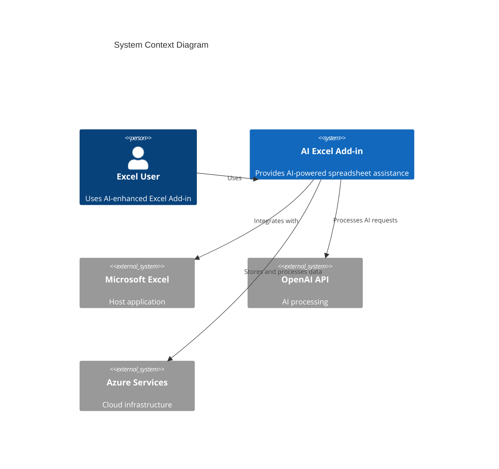
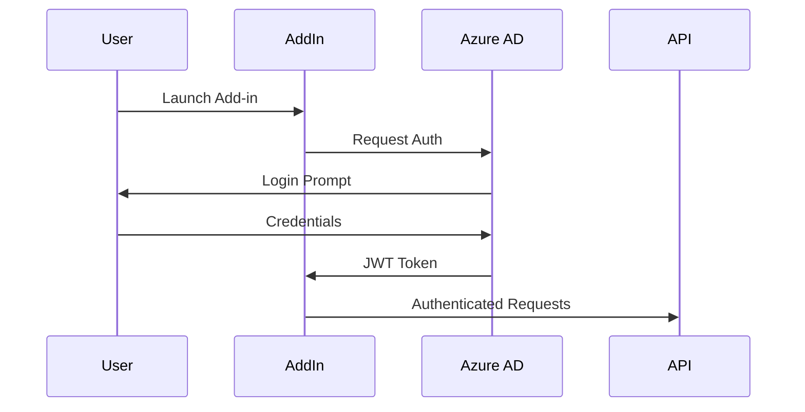

# AI-Enhanced Excel Add-In

[](https://dev.azure.com/company/excel-ai-addin/_build/latest?definitionId=1&branchName=main)
[](https://sonarcloud.io/dashboard?id=excel-ai-addin)
[](https://opensource.org/licenses/MIT)
[](https://github.com/company/excel-ai-addin/releases)
[](https://www.aicpa.org/soc2)
[](https://nodejs.org/)
[](https://www.python.org/)

## Introduction

The AI-Enhanced Excel Add-In is an enterprise-grade solution that seamlessly integrates artificial intelligence into Microsoft Excel, revolutionizing how users interact with spreadsheets. By combining real-time AI assistance, natural language processing, and automated data management capabilities, this add-in empowers users to work more efficiently and accurately with their spreadsheet data.

### Key Features

- 🤖 AI Formula Assistant with <2s response time
- 🧹 Automated data cleaning with 95% accuracy
- 🔒 Enterprise-grade security (SOC 2, ISO 27001 compliant)
- 🌐 Multi-region deployment with 99.99% uptime
- 📝 Real-time version control and auditing
- 💬 Natural language formula generation
- 📊 Automated data standardization
- 🔄 Seamless Microsoft 365 ecosystem integration

## Architecture

### System Overview



## Prerequisites

- Node.js 18 LTS
- Python 3.11+
- Microsoft 365 Developer Account
- Azure Subscription
- OpenAI API Key
- Docker Desktop
- Kubernetes CLI (kubectl)
- Azure CLI

## Quick Start

1. **Clone the Repository**
```bash
git clone https://github.com/company/excel-ai-addin.git
cd excel-ai-addin
```

2. **Install Dependencies**
```bash
npm install
python -m pip install -r requirements.txt
```

3. **Configure Environment**
```bash
cp .env.example .env
# Edit .env with your credentials
```

4. **Start Development Server**
```bash
npm run dev
```

5. **Build for Production**
```bash
npm run build
```

## Development

### Code Structure

```
excel-ai-addin/
├── src/
│   ├── client/          # React frontend
│   ├── server/          # Node.js backend
│   ├── ai/              # Python AI services
│   └── shared/          # Shared utilities
├── kubernetes/          # K8s configurations
├── terraform/           # Infrastructure as Code
├── tests/              # Test suites
└── docs/               # Documentation
```

### Development Workflow

1. Create feature branch from `main`
2. Implement changes with tests
3. Submit PR with required checks
4. Code review and approval
5. Merge to `main`

## Deployment

### Environment Strategy

| Environment | Purpose | Configuration |
|-------------|---------|---------------|
| Development | Feature development | Single region, minimal resources |
| Staging | Pre-production testing | Multi-region, production-like |
| Production | Live system | Full HA, multi-region |

### Deployment Commands

```bash
# Deploy to development
npm run deploy:dev

# Deploy to staging
npm run deploy:staging

# Deploy to production
npm run deploy:prod
```

## Security

### Authentication Flow



### Security Features

- 🔐 Azure AD Authentication
- 🔒 End-to-end encryption
- 📝 Comprehensive audit logging
- 🛡️ RBAC access control
- 🔍 Real-time threat monitoring

## Troubleshooting

### Common Issues

| Issue | Solution |
|-------|----------|
| Authentication Failed | Check Azure AD configuration |
| Slow Response Times | Verify network connectivity |
| Formula Generation Error | Check OpenAI API quota |

### Support

- 📧 Email: support@company.com
- 💬 Slack: #excel-ai-support
- 📚 Documentation: [docs.company.com/excel-ai](https://docs.company.com/excel-ai)

## Contributing

Please read our [Contributing Guidelines](CONTRIBUTING.md) before submitting changes.

### Pull Request Process

1. Update documentation
2. Add/update tests
3. Follow code style guidelines
4. Get two approvals
5. Squash and merge

## License

This project is licensed under the MIT License - see the [LICENSE](LICENSE) file for details.

---

© 2023 Company Name. All rights reserved.