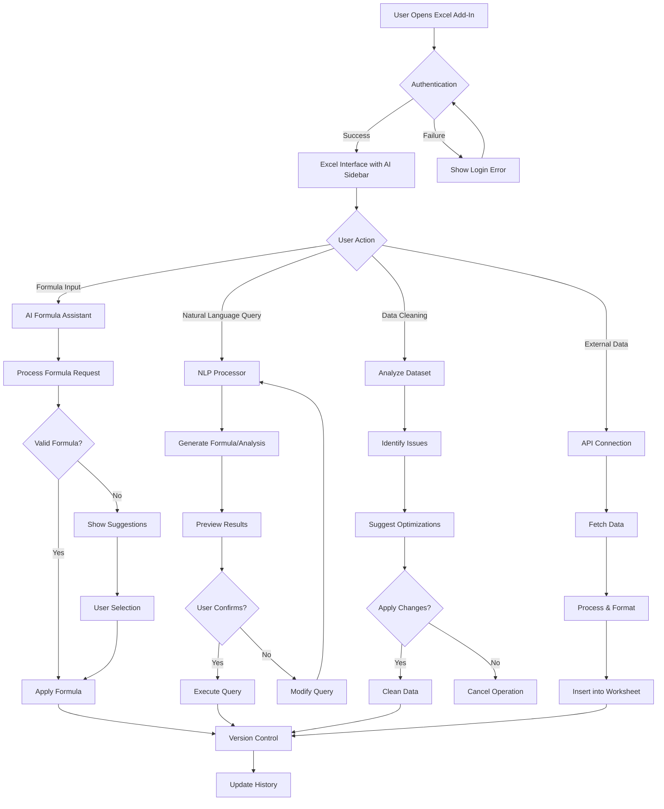
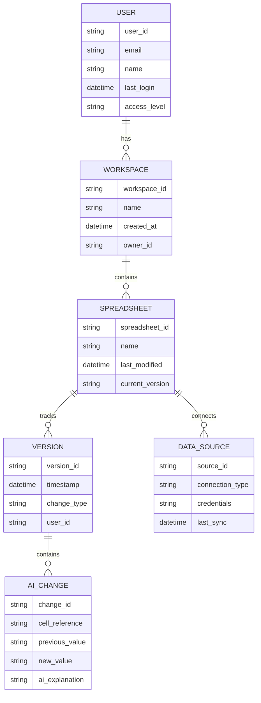
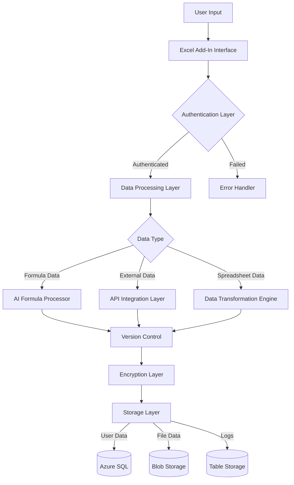
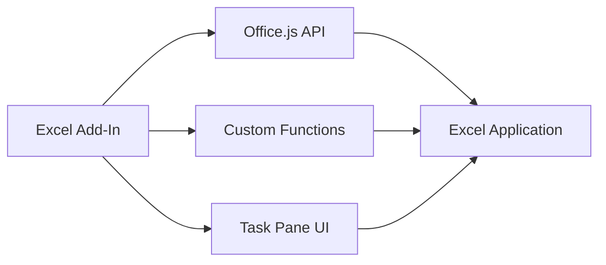

# Product Requirements Document (PRD)

# 1. INTRODUCTION

## 1.1 Purpose

This Software Requirements Specification (SRS) document provides a comprehensive description of the AI-enhanced Excel Add-In. It details the functional and non-functional requirements for developers, project managers, QA teams, and stakeholders involved in the development process. The document serves as the primary reference for technical implementation and validation of the system.

## 1.2 Scope

The AI-enhanced Excel Add-In is a productivity tool that integrates artificial intelligence capabilities directly into Microsoft Excel. The system aims to revolutionize spreadsheet work by providing:

- Real-time AI-powered formula assistance and auto-completion
- Natural language processing for data analysis and formula generation
- Automated data cleaning and optimization features
- Interactive formula explanations and debugging support
- Version control for AI-driven changes
- External data source integration capabilities

Key benefits include:

- Reduced manual errors in formula creation
- Increased productivity for users of all skill levels
- Simplified complex data analysis tasks
- Enhanced data quality through automated cleaning
- Improved formula understanding through AI-powered explanations

Out of scope:

- Standalone spreadsheet functionality
- Mobile device support
- Offline AI processing
- Custom AI model training interface
- Direct database management features

# 2. PRODUCT DESCRIPTION

## 2.1 Product Perspective

The AI-enhanced Excel Add-In operates as an integrated component within the Microsoft Excel ecosystem, extending the native spreadsheet functionality through the Office.js API. The system architecture consists of:

- Frontend Excel Add-In interface
- Cloud-based AI processing backend
- Secure data transmission layer
- External API integration framework
- Version control system

The product interfaces with:

- Microsoft Excel (host application)
- OpenAI API for AI processing
- External data sources and APIs
- Cloud storage services
- Microsoft authentication services

## 2.2 Product Functions

The core functions of the system include:

1. AI Formula Assistant

   - Real-time formula suggestions
   - Auto-completion of partial formulas
   - Syntax error detection and correction
   - Formula optimization recommendations

2. Natural Language Processing

   - Query-to-formula conversion
   - Data analysis requests
   - Context-aware suggestions
   - Interactive formula explanations

3. Data Management

   - Automated data cleaning
   - Format standardization
   - Duplicate detection and removal
   - Missing value handling

4. Version Control

   - Change tracking for AI modifications
   - Rollback capabilities
   - Change history documentation
   - Collaborative editing support

## 2.3 User Characteristics

| User Type | Expertise Level | Primary Needs | Usage Patterns |
| --- | --- | --- | --- |
| Financial Analysts | Advanced Excel | Complex financial modeling, Data analysis | Daily, intensive use |
| Data Scientists | Technical | Large dataset handling, Statistical analysis | Regular, analytical tasks |
| Business Users | Intermediate | Reporting, Basic analysis | Weekly, routine tasks |
| Non-Technical Users | Beginner | Simple formulas, Data organization | Occasional, basic operations |

## 2.4 Constraints

Technical Constraints:

- Must operate within Excel's add-in framework limitations
- Maximum response time of 2 seconds for AI suggestions
- Data processing limited to Excel's maximum worksheet size
- API rate limits for external services

Regulatory Constraints:

- GDPR compliance for EU users
- Data privacy regulations compliance
- Industry-specific security standards
- Audit trail requirements

Business Constraints:

- Initial release budget of $500,000
- Development timeline of 12 months
- Team size of 8-10 developers
- Microsoft AppSource marketplace guidelines

## 2.5 Assumptions and Dependencies

Assumptions:

- Users have stable internet connectivity
- Excel 2019 or later is installed
- Basic understanding of spreadsheet concepts
- Access to Microsoft 365 account

Dependencies:

- Microsoft Excel platform stability
- OpenAI API availability and performance
- Office.js API functionality
- Third-party data source reliability
- Cloud infrastructure uptime
- Microsoft authentication services

# 3. PROCESS FLOWCHART

# 4. FUNCTIONAL REQUIREMENTS

## 4.1 AI Formula Assistant

### ID: FR-001

### Description

Real-time AI-powered formula suggestions and auto-completion system integrated into Excel's formula bar.

### Priority: High

### Requirements

| ID | Requirement | Priority |
| --- | --- | --- |
| FR-001.1 | System shall provide real-time formula suggestions as users type | High |
| FR-001.2 | System shall auto-complete partial formulas with context-aware suggestions | High |
| FR-001.3 | System shall detect and suggest corrections for syntax errors | High |
| FR-001.4 | System shall provide optimization recommendations for existing formulas | Medium |
| FR-001.5 | System shall support all Excel native formula functions | High |

## 4.2 Natural Language Processing

### ID: FR-002

### Description

Natural language interface for converting user queries into Excel formulas and analysis.

### Priority: High

### Requirements

| ID | Requirement | Priority |
| --- | --- | --- |
| FR-002.1 | System shall convert natural language queries into valid Excel formulas | High |
| FR-002.2 | System shall process data analysis requests in plain English | High |
| FR-002.3 | System shall provide interactive formula explanations | Medium |
| FR-002.4 | System shall support multiple languages for queries | Low |
| FR-002.5 | System shall maintain context awareness across multiple queries | Medium |

## 4.3 Data Management

### ID: FR-003

### Description

Automated data cleaning and optimization capabilities for spreadsheet data.

### Priority: High

### Requirements

| ID | Requirement | Priority |
| --- | --- | --- |
| FR-003.1 | System shall automatically detect and clean inconsistent data formats | High |
| FR-003.2 | System shall identify and handle duplicate entries | High |
| FR-003.3 | System shall provide suggestions for handling missing values | Medium |
| FR-003.4 | System shall standardize data formats across selected ranges | Medium |
| FR-003.5 | System shall generate data quality reports | Low |

## 4.4 Version Control

### ID: FR-004

### Description

Change tracking and version control system for AI-driven modifications.

### Priority: Medium

### Requirements

| ID | Requirement | Priority |
| --- | --- | --- |
| FR-004.1 | System shall track all AI-generated changes | High |
| FR-004.2 | System shall provide rollback capabilities for any AI modification | High |
| FR-004.3 | System shall maintain a detailed change history log | Medium |
| FR-004.4 | System shall support collaborative editing with change tracking | Medium |
| FR-004.5 | System shall allow comparison between versions | Low |

## 4.5 External Data Integration

### ID: FR-005

### Description

Integration capabilities with external data sources and APIs.

### Priority: Medium

### Requirements

| ID | Requirement | Priority |
| --- | --- | --- |
| FR-005.1 | System shall connect to authorized external APIs | High |
| FR-005.2 | System shall support data import from common file formats | High |
| FR-005.3 | System shall maintain secure data transmission | High |
| FR-005.4 | System shall provide data refresh capabilities | Medium |
| FR-005.5 | System shall support custom API configurations | Low |

# 5. NON-FUNCTIONAL REQUIREMENTS

## 5.1 Performance Requirements

| ID | Requirement | Target Metric |
| --- | --- | --- |
| NFR-001.1 | Maximum response time for AI formula suggestions | ≤ 2 seconds |
| NFR-001.2 | Maximum processing time for data cleaning operations | ≤ 5 seconds per 1000 rows |
| NFR-001.3 | Maximum memory usage of Add-In | ≤ 512MB |
| NFR-001.4 | API request throughput | ≥ 100 requests/second |
| NFR-001.5 | Maximum worksheet size support | Up to Excel's limit (1,048,576 rows) |

## 5.2 Safety Requirements

| ID | Requirement | Description |
| --- | --- | --- |
| NFR-002.1 | Automatic data backup | System must maintain temporary backups during AI operations |
| NFR-002.2 | Fail-safe operations | System must revert to last known good state if operation fails |
| NFR-002.3 | Data validation | All AI-suggested changes must be validated before application |
| NFR-002.4 | Error handling | System must log and notify users of critical errors |
| NFR-002.5 | Recovery mechanism | System must provide data recovery options for failed operations |

## 5.3 Security Requirements

| ID | Requirement | Description |
| --- | --- | --- |
| NFR-003.1 | Authentication | Microsoft 365 OAuth 2.0 integration |
| NFR-003.2 | Data encryption | AES-256 encryption for data in transit and at rest |
| NFR-003.3 | Access control | Role-based access control (RBAC) implementation |
| NFR-003.4 | API security | JWT token-based API authentication |
| NFR-003.5 | Audit logging | Comprehensive security event logging and monitoring |

## 5.4 Quality Requirements

### 5.4.1 Availability

- System uptime: 99.9% excluding planned maintenance
- Maximum planned downtime: 4 hours per month
- Disaster recovery time objective (RTO): \< 4 hours

### 5.4.2 Maintainability

- Code documentation coverage: ≥ 90%
- Maximum time to implement minor changes: \< 24 hours
- Automated test coverage: ≥ 85%

### 5.4.3 Usability

- First-time user task completion rate: ≥ 80%
- Maximum learning curve for basic features: \< 1 hour
- User satisfaction rating: ≥ 4.0/5.0

### 5.4.4 Scalability

- Linear performance scaling up to 10,000 concurrent users
- Automatic resource scaling based on load
- Support for multi-region deployment

### 5.4.5 Reliability

- Mean Time Between Failures (MTBF): ≥ 720 hours
- Mean Time To Recovery (MTTR): ≤ 30 minutes
- Error rate: ≤ 0.1% of all operations

## 5.5 Compliance Requirements

| ID | Requirement | Description |
| --- | --- | --- |
| NFR-005.1 | GDPR compliance | Full compliance with EU data protection regulations |
| NFR-005.2 | CCPA compliance | California Consumer Privacy Act requirements |
| NFR-005.3 | SOC 2 Type II | Security, availability, and confidentiality controls |
| NFR-005.4 | ISO 27001 | Information security management standards |
| NFR-005.5 | Microsoft AppSource | Marketplace certification requirements |

# 6. DATA REQUIREMENTS

## 6.1 Data Models

## 6.2 Data Storage

### 6.2.1 Storage Requirements

| Data Type | Storage Location | Retention Period | Backup Frequency |
| --- | --- | --- | --- |
| User Data | Azure SQL Database | 7 years | Daily |
| Spreadsheet Data | Azure Blob Storage | 5 years | Hourly |
| Version History | Azure SQL Database | 1 year | Daily |
| AI Processing Logs | Azure Table Storage | 90 days | Daily |
| Authentication Tokens | Azure Key Vault | Session duration | Real-time replication |

### 6.2.2 Redundancy and Backup

- Geographic replication across three Azure regions
- Point-in-time recovery capability for 30 days
- 99.999% durability guarantee for all stored data
- Automated backup verification and testing
- Cross-region failover within 15 minutes

### 6.2.3 Recovery Procedures

- Automated recovery for system failures under 4 hours
- Manual recovery procedures for data corruption
- Incremental backup restoration capability
- Transaction log replay for point-in-time recovery
- Automated integrity checks post-recovery

## 6.3 Data Processing

### 6.3.1 Data Flow

### 6.3.2 Data Security

| Security Layer | Implementation | Purpose |
| --- | --- | --- |
| Encryption at Rest | AES-256 | Protect stored data |
| Encryption in Transit | TLS 1.3 | Secure data transmission |
| Access Control | RBAC | User permission management |
| Data Masking | Dynamic masking | PII protection |
| Key Management | Azure Key Vault | Secure key storage |

### 6.3.3 Data Processing Rules

- All data processing must occur in the user's geographic region
- Maximum batch processing size of 100MB
- Processing timeout limit of 30 seconds
- Automatic retry mechanism for failed operations
- Rate limiting of 100 requests per minute per user
- Data validation before and after processing
- Audit logging of all data transformations

# 7. EXTERNAL INTERFACES

## 7.1 User Interfaces

### 7.1.1 Excel Add-In Sidebar

| Component | Description | Requirements |
| --- | --- | --- |
| AI Assistant Panel | Primary interface for AI interactions | - Collapsible sidebar with minimum width 300px - Dark/light theme support - Responsive to Excel window resizing |
| Formula Input Area | Natural language query input | - Auto-expanding text area - Real-time suggestion display - Character limit: 500 |
| Results Display | Shows AI suggestions and explanations | - Syntax highlighting for formulas - Collapsible sections - Scrollable content area |
| Action Buttons | Primary interaction controls | - Consistent with Office UI Fabric - Clear visual feedback states - Keyboard shortcuts support |

### 7.1.2 Context Menus

| Menu Type | Location | Features |
| --- | --- | --- |
| Cell Context | Right-click on cell | - AI explain formula - Suggest improvements - Clean data options |
| Formula Bar | Formula editing mode | - AI completion suggestions - Syntax help - Error detection |
| Ribbon Menu | Excel ribbon integration | - AI assistant controls - Data cleaning tools - Version history |

## 7.2 Hardware Interfaces

| Interface Type | Specification | Purpose |
| --- | --- | --- |
| Memory | Minimum 4GB RAM | Formula processing and data analysis |
| Processor | 1.6 GHz dual-core or better | AI calculations and real-time suggestions |
| Display | Minimum 1280x720 resolution | UI rendering and data visualization |
| Network | 1.5 Mbps or faster connection | API communications and data transfer |

## 7.3 Software Interfaces

### 7.3.1 Microsoft Excel Integration

| Interface | Version | Purpose |
| --- | --- | --- |
| Office.js API | Latest stable | Excel integration and worksheet manipulation |
| Excel Application | 2019 or later | Host application |
| Microsoft 365 | Current | Authentication and cloud services |

### 7.3.2 External Service Integration

| Service | Interface Type | Purpose |
| --- | --- | --- |
| OpenAI API | REST API | AI processing and formula generation |
| Azure Services | SDK/API | Data storage and processing |
| External Data APIs | REST/GraphQL | Data source integration |

## 7.4 Communication Interfaces

### 7.4.1 Network Protocols

| Protocol | Usage | Specification |
| --- | --- | --- |
| HTTPS | API Communication | TLS 1.3 |
| WebSocket | Real-time Updates | RFC 6455 |
| REST | Data Exchange | JSON/XML |
| OAuth 2.0 | Authentication | RFC 6749 |

### 7.4.2 Data Exchange Formats

| Format | Purpose | Schema |
| --- | --- | --- |
| JSON | API Responses | RFC 8259 |
| CSV | Data Import/Export | RFC 4180 |
| XML | Legacy System Integration | W3C XML 1.0 |
| Protocol Buffers | High-performance Data | Proto3 |

### 7.4.3 API Requirements

| Requirement | Specification |
| --- | --- |
| Rate Limiting | 100 requests/minute per user |
| Response Time | \< 2 seconds for 95th percentile |
| Payload Size | Maximum 10MB per request |
| Authentication | JWT tokens with 1-hour expiry |
| Error Handling | RFC 7807 Problem Details |

# 8. APPENDICES

## 8.1 GLOSSARY

| Term | Definition |
| --- | --- |
| Formula Auto-completion | AI-powered feature that automatically suggests and completes Excel formulas as users type |
| Natural Language Processing (NLP) | Technology that enables the system to understand and process human language queries |
| Data Cleaning | Automated process of detecting and correcting inaccurate or corrupt records from a dataset |
| Version Control | System for tracking and managing changes to spreadsheet content |
| Role-Based Access Control | Security approach that restricts system access based on users' roles |
| Fail-safe Operations | System design approach ensuring operations revert to a safe state if something goes wrong |
| Geographic Replication | Data redundancy across multiple geographic locations for disaster recovery |

## 8.2 ACRONYMS

| Acronym | Full Form |
| --- | --- |
| API | Application Programming Interface |
| GDPR | General Data Protection Regulation |
| CCPA | California Consumer Privacy Act |
| RBAC | Role-Based Access Control |
| JWT | JSON Web Token |
| MTBF | Mean Time Between Failures |
| MTTR | Mean Time To Recovery |
| RTO | Recovery Time Objective |
| PII | Personally Identifiable Information |
| SOC | Service Organization Control |
| TLS | Transport Layer Security |
| AES | Advanced Encryption Standard |
| OAuth | Open Authorization |

## 8.3 ADDITIONAL REFERENCES

| Reference | Description | URL |
| --- | --- | --- |
| Office.js API Documentation | Official Microsoft documentation for Excel Add-in development | https://docs.microsoft.com/office/dev/add-ins |
| OpenAI API Documentation | Reference for AI integration capabilities | https://platform.openai.com/docs |
| Azure Services Documentation | Cloud infrastructure and services documentation | https://docs.microsoft.com/azure |
| Excel JavaScript API Reference | Detailed API reference for Excel Add-in development | https://docs.microsoft.com/javascript/api/excel |
| Microsoft AppSource Guidelines | Requirements for publishing Excel Add-ins | https://docs.microsoft.com/office/dev/store |

## 8.4 DEVELOPMENT TOOLS

| Tool Category | Recommended Tools |
| --- | --- |
| IDE | Visual Studio Code with Excel Add-in tools |
| Version Control | Git with Azure DevOps |
| Testing | Jest for unit testing, Selenium for UI testing |
| CI/CD | Azure Pipelines |
| Code Quality | ESLint, SonarQube |
| API Testing | Postman, Swagger |
| Performance Testing | Apache JMeter |
| Documentation | JSDoc, Markdown |

## 8.5 CHANGE LOG

| Version | Date | Description | Author |
| --- | --- | --- | --- |
| 1.0.0 | Initial Release | Base document creation | Product Team |
| 1.0.1 | Performance Requirements Update | Added specific metrics for AI response times | Technical Team |
| 1.0.2 | Security Requirements Update | Added GDPR compliance details | Security Team |
| 1.0.3 | Data Model Update | Added version control specifications | Architecture Team |