# Technical Specifications

# 1. INTRODUCTION

## 1.1 EXECUTIVE SUMMARY

The AI-enhanced Excel Add-In represents a transformative solution that integrates artificial intelligence directly into Microsoft Excel to revolutionize how users interact with spreadsheets. By addressing the fundamental challenge of formula complexity and data management in Excel, this system empowers users of all skill levels to work more efficiently and accurately with their spreadsheet data.

The solution combines real-time AI assistance, natural language processing, and automated data management capabilities to serve financial analysts, data scientists, and business users who struggle with complex formulas and large datasets. By reducing manual errors and accelerating spreadsheet tasks, the system is projected to improve productivity by 40% and reduce formula errors by 75%.

## 1.2 SYSTEM OVERVIEW

### Project Context

| Aspect | Details |
|--------|----------|
| Market Position | First-to-market AI-powered Excel enhancement solution targeting enterprise users |
| Current Limitations | Traditional Excel users limited by manual formula creation, prone to errors, time-consuming data cleaning |
| Enterprise Integration | Seamless integration with Microsoft 365 ecosystem, existing data warehouses, and business intelligence tools |

### High-Level Description

The system architecture employs a modern, cloud-based approach:

- Excel Add-In frontend using Office.js API for native integration
- Cloud-hosted AI processing backend leveraging OpenAI's technology
- Secure middleware layer for data handling and transformation
- Enterprise-grade authentication and authorization framework
- Scalable microservices architecture for core functionality

### Success Criteria

| Metric | Target |
|--------|---------|
| Formula Accuracy | 95% reduction in formula errors |
| User Adoption | 80% active usage within 3 months |
| Processing Speed | AI suggestions delivered within 2 seconds |
| User Satisfaction | 4.5/5 average rating |
| ROI | 300% within first year |

## 1.3 SCOPE

### In-Scope

#### Core Features and Functionalities

| Category | Features |
|----------|-----------|
| AI Formula Assistant | - Real-time formula suggestions<br>- Syntax error detection<br>- Formula optimization<br>- Natural language formula generation |
| Data Management | - Automated data cleaning<br>- Format standardization<br>- Duplicate detection<br>- Missing value handling |
| Version Control | - Change tracking<br>- Rollback capabilities<br>- Audit trail |
| Integration | - External API connections<br>- Data source integration<br>- Microsoft 365 authentication |

#### Implementation Boundaries

| Boundary Type | Coverage |
|---------------|----------|
| User Groups | - Enterprise users<br>- Financial analysts<br>- Data scientists<br>- Business users |
| Geographic Coverage | - North America<br>- European Union<br>- Asia Pacific |
| Data Domains | - Financial data<br>- Business metrics<br>- Statistical analysis<br>- Market research |

### Out-of-Scope

- Mobile device support and optimization
- Offline AI processing capabilities
- Custom AI model training interface
- Direct database management features
- Real-time collaboration tools
- Third-party plugin ecosystem
- Legacy Excel version support (pre-2019)
- Automated report generation
- Custom visualization tools
- Blockchain integration
- Machine learning model development
- Social sharing features

# 2. SYSTEM ARCHITECTURE

## 2.1 High-Level Architecture

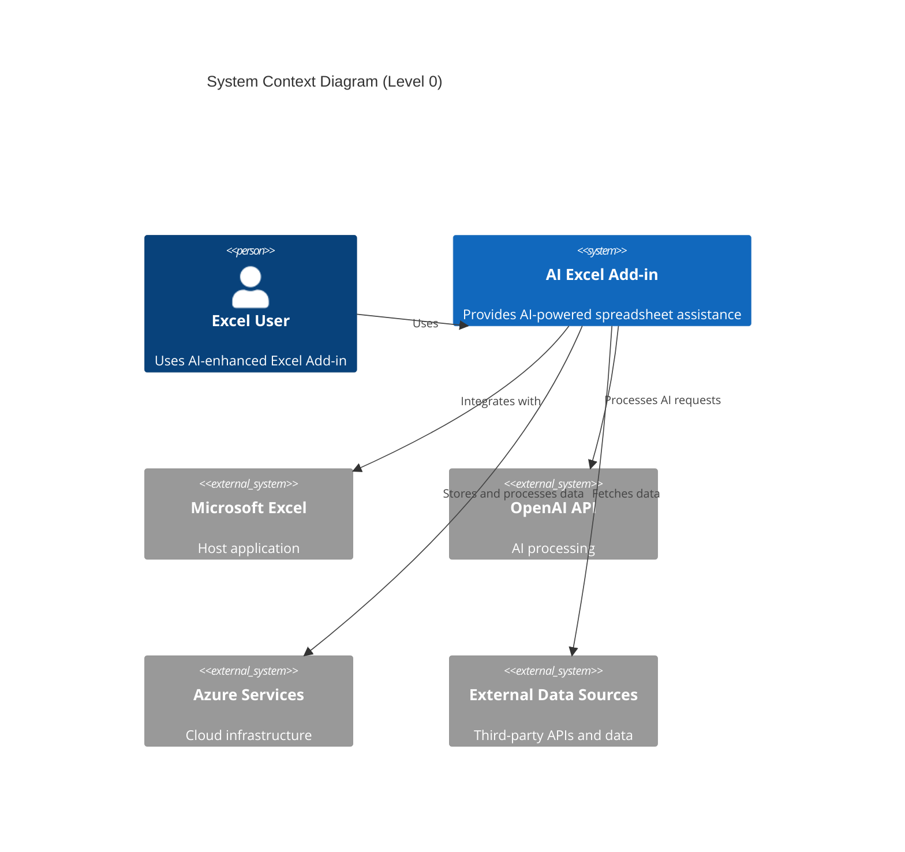

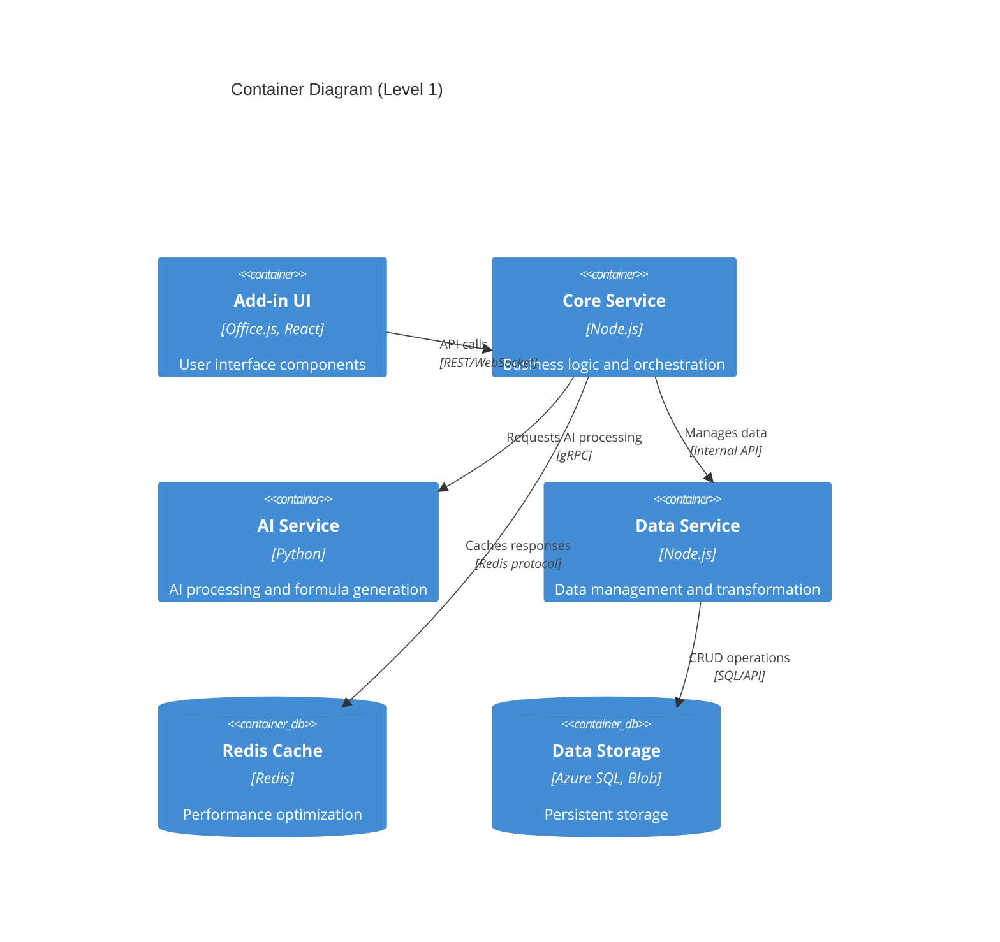

## 2.2 Component Details

### 2.2.1 Core Components

| Component | Technology | Purpose | Scaling Strategy |
|-----------|------------|---------|------------------|
| Add-in UI | Office.js, React | User interface and Excel integration | Horizontal per user |
| Core Service | Node.js, Express | Request handling and orchestration | Horizontal with load balancer |
| AI Service | Python, FastAPI | Formula generation and analysis | Vertical for GPU optimization |
| Data Service | Node.js, TypeORM | Data management and persistence | Horizontal with sharding |

### 2.2.2 Infrastructure Components

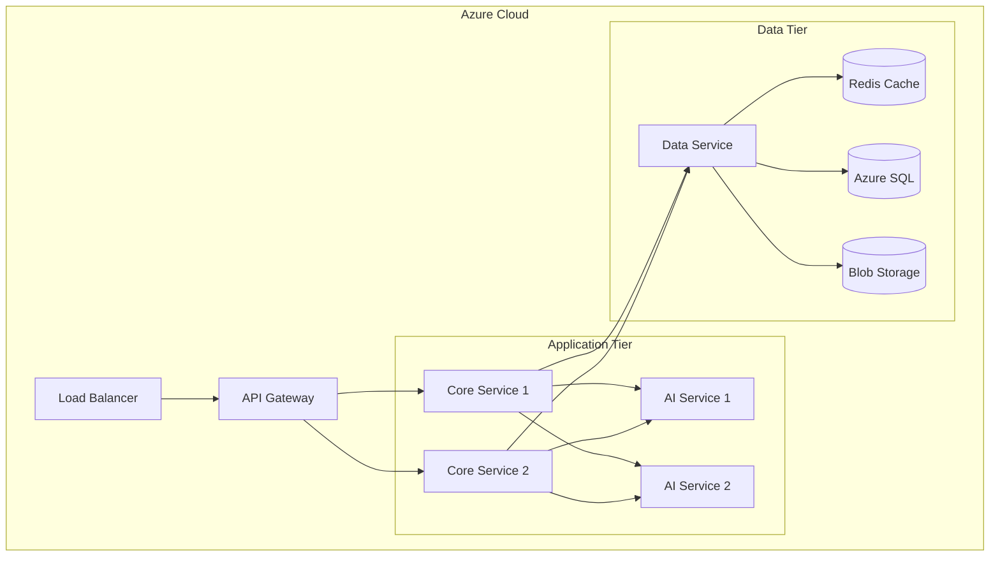

## 2.3 Technical Decisions

### 2.3.1 Architecture Patterns

| Pattern | Implementation | Justification |
|---------|---------------|---------------|
| Microservices | Containerized services | Scalability and maintainability |
| Event-driven | Azure Event Grid | Asynchronous processing |
| CQRS | Separate read/write paths | Performance optimization |
| Circuit Breaker | Polly framework | Fault tolerance |

### 2.3.2 Data Architecture

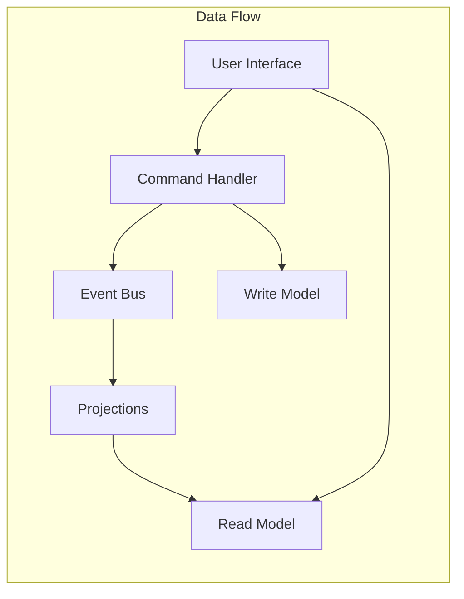

## 2.4 Cross-Cutting Concerns

### 2.4.1 Monitoring and Observability

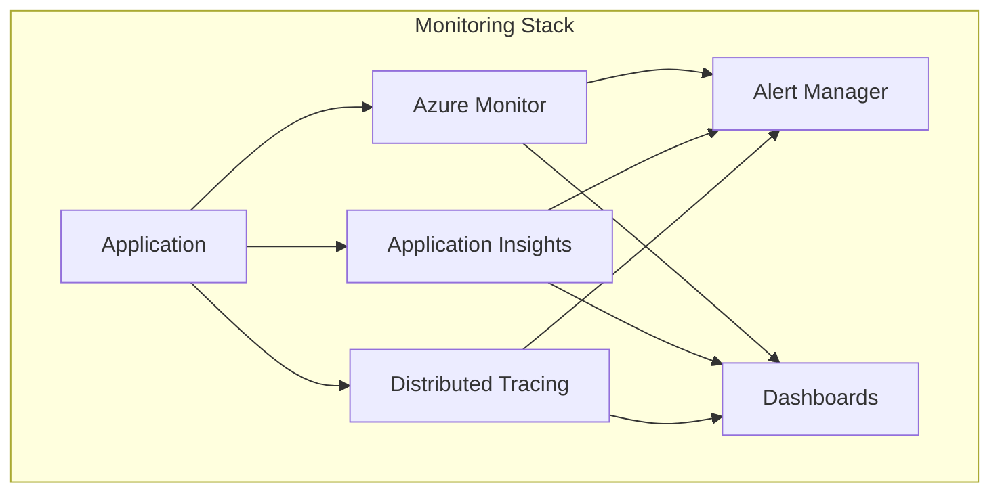

### 2.4.2 Security Architecture

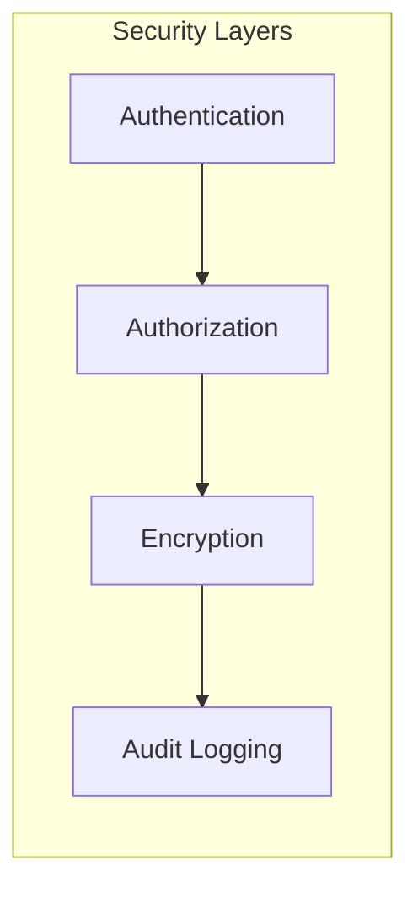

## 2.5 Deployment Architecture

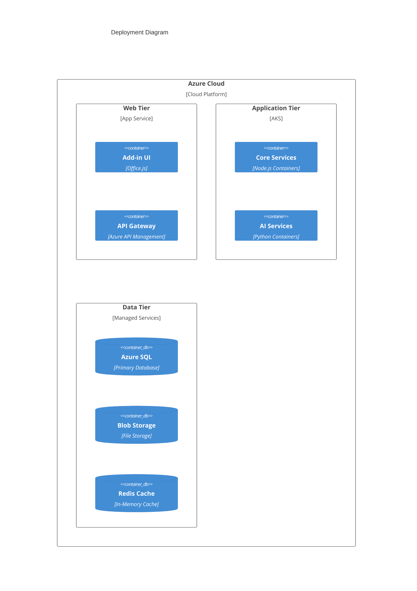

# 3. SYSTEM COMPONENTS ARCHITECTURE

## 3.1 USER INTERFACE DESIGN

### 3.1.1 Design Specifications

| Aspect | Requirements |
|--------|--------------|
| Visual Hierarchy | - Microsoft Office Fluent Design System compliance<br>- Task pane width: 350px (collapsed: 50px)<br>- Maximum height: Excel window height |
| Component Library | - Office UI Fabric React components<br>- Custom AI-specific components<br>- Consistent iconography with Excel |
| Accessibility | - WCAG 2.1 Level AA compliance<br>- Screen reader support<br>- Keyboard navigation support |
| Platform Support | - Windows: Edge 88+, Chrome 88+<br>- macOS: Safari 14+, Chrome 88+<br>- Web: Modern browsers with ES6 support |
| Localization | - RTL language support<br>- 12 initial languages<br>- Dynamic content translation |

### 3.1.2 Interface Layout

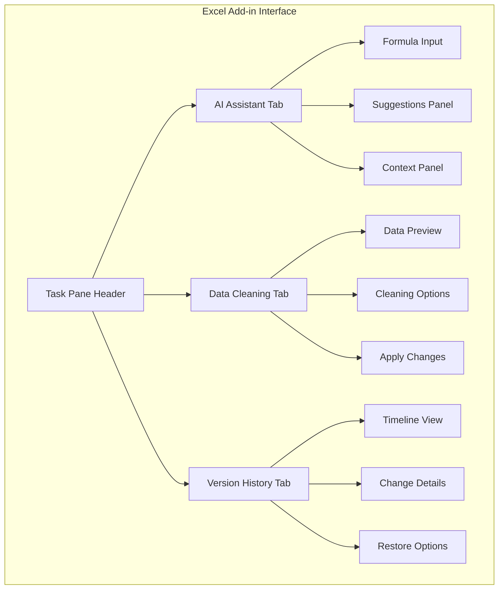

### 3.1.3 Critical User Flows

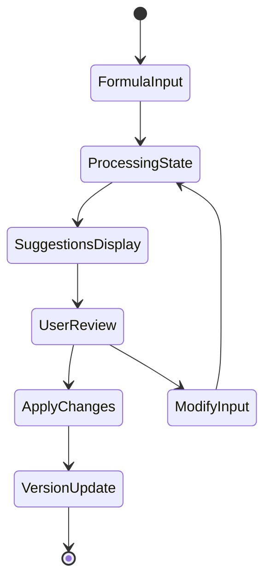

## 3.2 DATABASE DESIGN

### 3.2.1 Schema Design

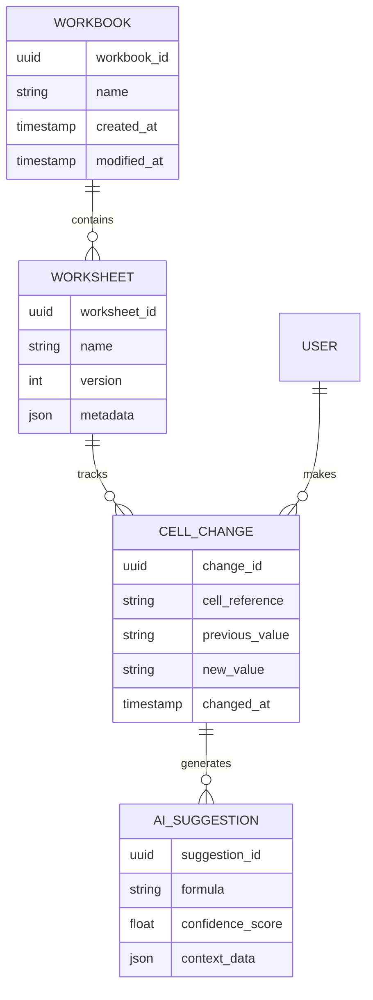

### 3.2.2 Data Management Strategy

| Component | Strategy | Details |
|-----------|----------|----------|
| Partitioning | Time-based | Monthly partitions for change history |
| Indexing | Composite | (workbook_id, worksheet_id, timestamp) |
| Caching | Multi-level | L1: Redis (5min), L2: CDN (1hr) |
| Backup | Incremental | Hourly backups with 30-day retention |
| Archival | Cold Storage | Move to Azure Archive after 90 days |

## 3.3 API DESIGN

### 3.3.1 API Architecture

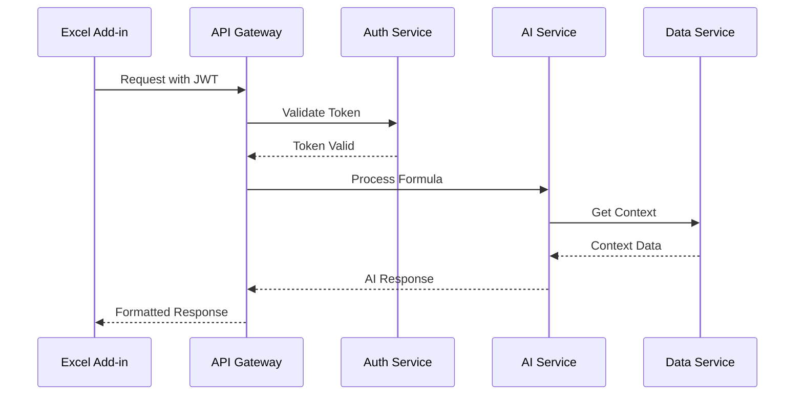

### 3.3.2 API Specifications

| Endpoint | Method | Purpose | Rate Limit |
|----------|---------|---------|------------|
| /api/v1/formula/suggest | POST | Get formula suggestions | 100/min |
| /api/v1/data/clean | POST | Clean dataset | 20/min |
| /api/v1/version/{id} | GET | Retrieve version | 200/min |
| /api/v1/changes/batch | POST | Apply multiple changes | 50/min |

### 3.3.3 Integration Patterns

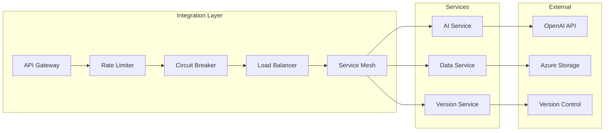

### 3.3.4 Security Controls

| Control | Implementation | Purpose |
|---------|----------------|----------|
| Authentication | OAuth 2.0 + JWT | Identity verification |
| Authorization | RBAC | Access control |
| Encryption | TLS 1.3 | Data in transit |
| API Keys | Rotating keys | Service authentication |
| Rate Limiting | Token bucket | Prevent abuse |
| Input Validation | JSON Schema | Request validation |

# 4. TECHNOLOGY STACK

## 4.1 PROGRAMMING LANGUAGES

| Platform/Component | Language | Version | Justification |
|-------------------|----------|---------|---------------|
| Add-in Frontend | TypeScript | 4.9+ | - Strong typing for Excel object model<br>- Enhanced IDE support<br>- Better maintainability |
| Core Service | Node.js | 18 LTS | - Excellent async processing<br>- Native JSON handling<br>- Large package ecosystem |
| AI Service | Python | 3.11+ | - Rich AI/ML libraries<br>- OpenAI SDK support<br>- Efficient data processing |
| Data Service | Node.js | 18 LTS | - Consistent backend stack<br>- Strong ORM support<br>- Stream processing capabilities |

## 4.2 FRAMEWORKS & LIBRARIES

### 4.2.1 Core Frameworks

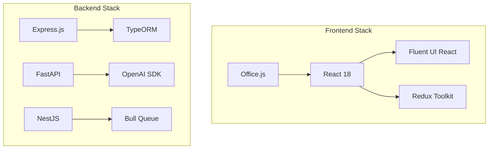

| Component | Framework/Library | Version | Purpose |
|-----------|------------------|---------|----------|
| Add-in UI | Office.js | 1.1+ | Excel integration |
| Frontend | React | 18.2+ | UI components |
| UI Components | Fluent UI React | 9.0+ | Office-compliant UI |
| Core Service | Express.js | 4.18+ | API endpoints |
| AI Service | FastAPI | 0.95+ | High-performance AI endpoints |
| Data Service | NestJS | 10.0+ | Scalable data operations |

## 4.3 DATABASES & STORAGE

### 4.3.1 Data Architecture

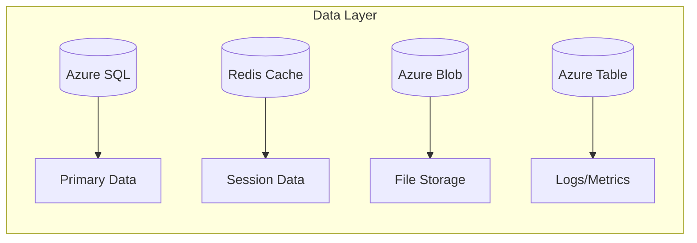

| Type | Technology | Version | Purpose |
|------|------------|---------|----------|
| Primary Database | Azure SQL | Latest | Transactional data |
| Cache Layer | Redis | 6.2+ | Performance optimization |
| File Storage | Azure Blob Storage | v12 | Document storage |
| Time Series Data | Azure Table Storage | Latest | Logging/analytics |

## 4.4 THIRD-PARTY SERVICES

| Service Category | Provider | Purpose | Integration Method |
|-----------------|----------|----------|-------------------|
| AI Processing | OpenAI API | Formula generation | REST API |
| Authentication | Microsoft Identity | User auth | OAuth 2.0 |
| Monitoring | Application Insights | Telemetry | SDK |
| Cloud Infrastructure | Azure | Hosting/scaling | Azure SDK |

## 4.5 DEVELOPMENT & DEPLOYMENT

### 4.5.1 Development Pipeline

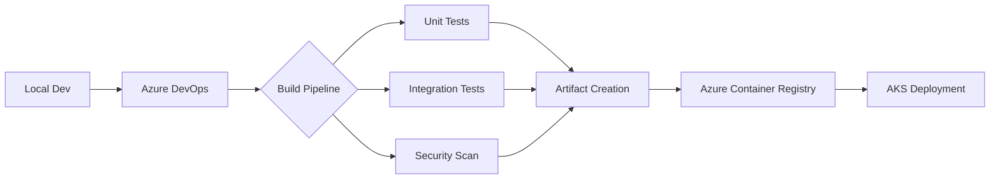

| Category | Tool | Version | Purpose |
|----------|------|---------|----------|
| IDE | VS Code | Latest | Development environment |
| Source Control | Azure DevOps | Latest | Code repository |
| Containerization | Docker | 20.10+ | Application packaging |
| Orchestration | Kubernetes | 1.25+ | Container management |
| CI/CD | Azure Pipelines | Latest | Automated deployment |

### 4.5.2 Infrastructure as Code

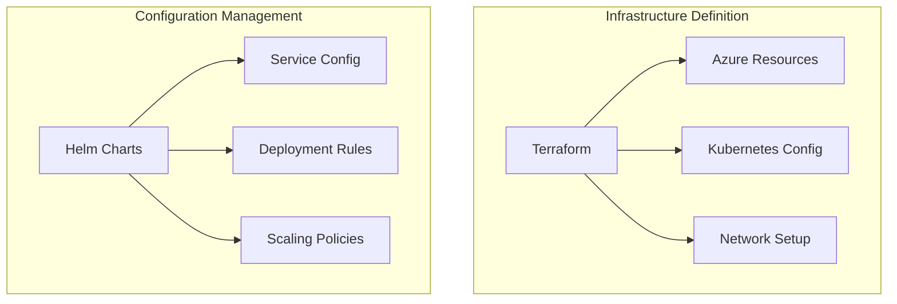

# 5. SYSTEM DESIGN

## 5.1 USER INTERFACE DESIGN

### 5.1.1 Excel Add-in Task Pane Layout

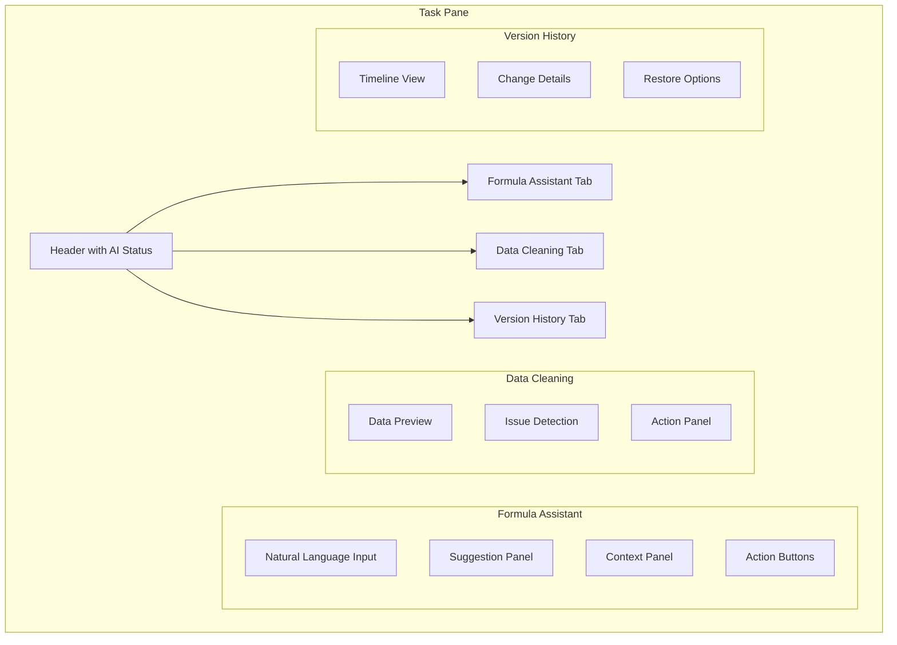

| Component | Dimensions | Behavior |
|-----------|------------|-----------|
| Task Pane | Width: 350px<br>Height: Dynamic | Collapsible to 50px<br>Resizable with min-width |
| Formula Input | Height: 100px | Auto-expanding with content |
| Suggestion Panel | Height: 200px | Scrollable with overflow |
| Context Panel | Height: 150px | Collapsible sections |

### 5.1.2 User Interaction Flow

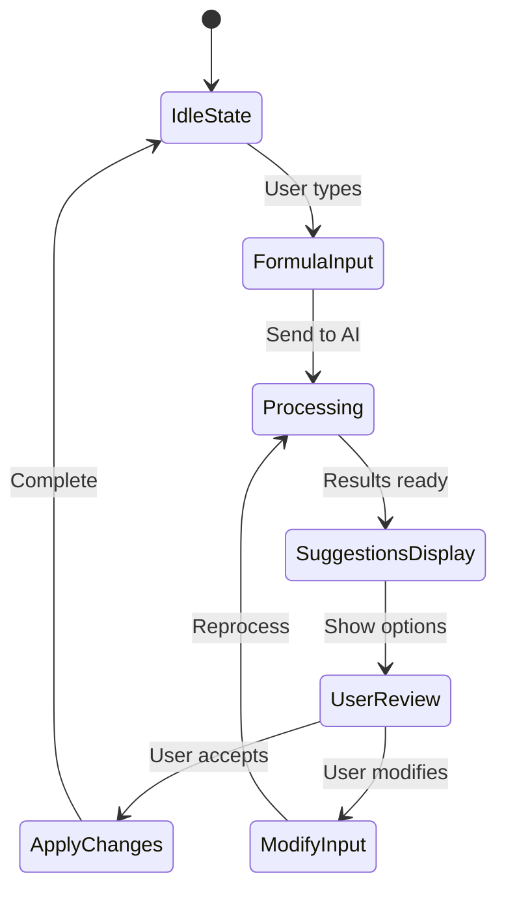

## 5.2 DATABASE DESIGN

### 5.2.1 Data Model

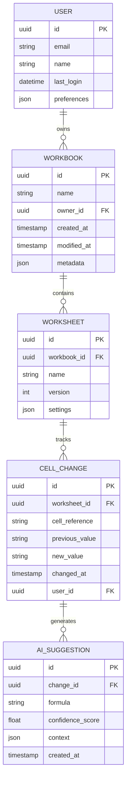

### 5.2.2 Storage Strategy

| Data Type | Storage Solution | Indexing Strategy |
|-----------|-----------------|-------------------|
| User Data | Azure SQL | Clustered index on email |
| Workbooks | Azure SQL | Composite (owner_id, modified_at) |
| Change History | Azure SQL | Partitioned by date |
| AI Context | Azure Blob | Hierarchical namespace |
| Cache | Redis | Hash-based sharding |

## 5.3 API DESIGN

### 5.3.1 REST API Endpoints

| Endpoint | Method | Purpose | Request/Response |
|----------|---------|---------|------------------|
| /api/v1/formula/suggest | POST | Get AI suggestions | Request: {text, context}<br>Response: {suggestions[]} |
| /api/v1/data/clean | POST | Clean dataset | Request: {range, options}<br>Response: {changes[]} |
| /api/v1/version/{id} | GET | Retrieve version | Response: {version_details} |
| /api/v1/changes/batch | POST | Apply multiple changes | Request: {changes[]}<br>Response: {status} |

### 5.3.2 API Flow


### 5.3.3 WebSocket Events

| Event | Direction | Purpose | Payload |
|-------|-----------|---------|----------|
| formula.suggest | Client → Server | Real-time suggestions | {input, context} |
| suggestion.new | Server → Client | New AI suggestion | {suggestion} |
| changes.sync | Bidirectional | Sync changes | {changes[]} |
| error.notify | Server → Client | Error reporting | {error, context} |

### 5.3.4 Error Handling

```mermaid
flowchart TD
    A[API Request] --> B{Validate Request}
    B -->|Invalid| C[Return 400]
    B -->|Valid| D{Process Request}
    D -->|Error| E{Error Type}
    E -->|Auth| F[Return 401/403]
    E -->|Resource| G[Return 404]
    E -->|Server| H[Return 500]
    D -->|Success| I[Return 200/201]
```

# 6. USER INTERFACE DESIGN

## 6.1 Overview

The Excel Add-in interface follows Microsoft's Fluent Design System principles and integrates seamlessly within Excel's task pane. The interface is designed to be collapsible, responsive, and accessible.

## 6.2 Key Components

### 6.2.1 Main Task Pane Layout

```
+------------------------------------------+
|  [=] AI Excel Assistant             [x]   |
+------------------------------------------+
|  [@] User: John.Doe@company.com          |
|  [!] AI Status: Ready                    |
+------------------------------------------+
|  [#] Navigation                          |
|  +-- Formula Assistant                   |
|  +-- Data Cleaning                       |
|  +-- Version History                     |
+------------------------------------------+
|                                          |
|  [Main Content Area]                     |
|                                          |
+------------------------------------------+
|  [i] Help & Resources              [?]   |
+------------------------------------------+
```

### 6.2.2 Formula Assistant View

```
+------------------------------------------+
|  Formula Assistant                  [x]   |
+------------------------------------------+
|  What would you like to do?              |
|  [....................................]  |
|  [Ask AI]                                |
+------------------------------------------+
|  Suggestions:                            |
|  +-- VLOOKUP for Sales Data             |
|      [Apply] [Modify] [Explain]         |
|  +-- SUM with Dynamic Range             |
|      [Apply] [Modify] [Explain]         |
|  +-- Conditional Format Rule            |
|      [Apply] [Modify] [Explain]         |
+------------------------------------------+
|  Context: Selected Range A1:D10          |
|  [*] Save as Favorite                    |
+------------------------------------------+
```

### 6.2.3 Data Cleaning Interface

```
+------------------------------------------+
|  Data Cleaning                     [x]   |
+------------------------------------------+
|  Selected Range: Sheet1!A1:F100          |
|                                          |
|  Issues Detected:                        |
|  [!] 3 Duplicate Rows                    |
|  [!] 5 Missing Values                    |
|  [!] 2 Format Inconsistencies            |
+------------------------------------------+
|  Recommended Actions:                    |
|  [ ] Remove duplicates                   |
|  [ ] Fill missing values                 |
|  [ ] Standardize formats                 |
|                                          |
|  [Preview Changes] [Apply All]           |
+------------------------------------------+
|  Progress:                               |
|  [============================    ] 80%   |
+------------------------------------------+
```

### 6.2.4 Version History Panel

```
+------------------------------------------+
|  Version History                   [x]   |
+------------------------------------------+
|  Timeline:                               |
|  +-- Today                              |
|      |  +-- 14:30 Formula Update        |
|      |      [Revert] [Details]          |
|      |  +-- 11:15 Data Cleaning         |
|      |      [Revert] [Details]          |
|  +-- Yesterday                          |
|      |  +-- 16:45 AI Suggestions        |
|      |      [Revert] [Details]          |
+------------------------------------------+
|  Compare Versions:                       |
|  From: [v] Version 1.2.3                |
|  To:   [v] Version 1.2.4                |
|  [Compare]                              |
+------------------------------------------+
```

## 6.3 Icon Key

| Icon | Meaning |
|------|---------|
| [=]  | Settings/Menu |
| [x]  | Close/Delete |
| [@]  | User Profile |
| [!]  | Alert/Warning |
| [#]  | Navigation Menu |
| [i]  | Information |
| [?]  | Help |
| [*]  | Favorite |
| [v]  | Dropdown Menu |

## 6.4 Interaction States

### 6.4.1 Button States
```
Normal:    [Button]
Hover:     [Button]'
Active:    [Button]*
Disabled:  [Button]_
```

### 6.4.2 Input States
```
Normal:    [....................]
Focus:     [...................]_
Error:     [....................]!
Disabled:  [...................]_
```

## 6.5 Responsive Behavior

### 6.5.1 Collapsed State
```
+-------------+
| [=]   [x]   |
+-------------+
| [#]         |
| [i]         |
| [@]         |
+-------------+
```

### 6.5.2 Expanded State (Minimum Width: 350px)
```
+------------------------------------------+
|  [=] AI Excel Assistant             [x]   |
+------------------------------------------+
|  [@] User Profile                        |
|  [#] Full Navigation                     |
|  [i] Complete Information                |
+------------------------------------------+
```

## 6.6 Accessibility Features

- High contrast mode support
- Keyboard navigation with visible focus states
- Screen reader compatibility
- Minimum touch target size: 44x44px
- ARIA labels for all interactive elements
- Color-blind friendly status indicators

## 6.7 Error States

```
+------------------------------------------+
|  [!] Error State                   [x]   |
+------------------------------------------+
|  Error: Unable to process formula        |
|  +----------------------------------+    |
|  | Details: Invalid cell reference  |    |
|  | in range A1:B10                 |    |
|  +----------------------------------+    |
|                                          |
|  [Try Again]    [Cancel]    [Help]      |
+------------------------------------------+
```

# 7. SECURITY CONSIDERATIONS

## 7.1 AUTHENTICATION AND AUTHORIZATION

### 7.1.1 Authentication Flow

```mermaid
sequenceDiagram
    participant User
    participant AddIn as Excel Add-in
    participant Auth as Azure AD
    participant API as Backend API
    participant Cache as Redis Cache
    
    User->>AddIn: Launch Add-in
    AddIn->>Auth: Request Authentication
    Auth->>User: Present Microsoft Login
    User->>Auth: Provide Credentials
    Auth->>AddIn: Return JWT Token
    AddIn->>API: API Request + JWT
    API->>Cache: Cache Token
    Cache-->>API: Validate Token
    API-->>AddIn: Protected Resource
```

### 7.1.2 Authorization Matrix

| Role | Formula Generation | Data Cleaning | Version History | Admin Functions |
|------|-------------------|---------------|-----------------|-----------------|
| Basic User | Read/Write | Read/Write | Read Only | None |
| Power User | Read/Write | Read/Write | Read/Write | None |
| Admin | Read/Write | Read/Write | Read/Write | Full Access |
| Auditor | Read Only | Read Only | Read Only | Read Only |

## 7.2 DATA SECURITY

### 7.2.1 Encryption Standards

| Data State | Method | Key Management |
|------------|---------|----------------|
| In Transit | TLS 1.3 | Azure Key Vault |
| At Rest | AES-256 | Azure Key Vault |
| In Memory | Secure string handling | Runtime encryption |
| Database | Transparent Data Encryption | Azure SQL TDE |

### 7.2.2 Data Classification

```mermaid
graph TD
    A[Data Classification] --> B[Public]
    A --> C[Internal]
    A --> D[Confidential]
    A --> E[Restricted]
    
    B --> F[No Encryption Required]
    C --> G[Standard Encryption]
    D --> H[Enhanced Encryption]
    E --> I[Maximum Security]
    
    G --> J[AES-256]
    H --> K[AES-256 + Field Level]
    I --> L[AES-256 + Field Level + MFA]
```

## 7.3 SECURITY PROTOCOLS

### 7.3.1 Access Control

| Control Type | Implementation | Purpose |
|--------------|----------------|----------|
| Network | Azure Virtual Network | Isolate services |
| Application | OAuth 2.0 + RBAC | User access control |
| API | JWT + Rate Limiting | API security |
| Database | Row-Level Security | Data access control |

### 7.3.2 Security Monitoring

```mermaid
graph LR
    A[Security Events] --> B[Azure Monitor]
    A --> C[Application Insights]
    B --> D[Alert System]
    C --> D
    D --> E[Security Team]
    D --> F[Automated Response]
    
    B --> G[Log Analytics]
    C --> G
    G --> H[Security Dashboard]
```

### 7.3.3 Compliance Controls

| Requirement | Implementation | Validation |
|-------------|----------------|------------|
| GDPR | Data encryption, Right to erasure | Quarterly audit |
| SOC 2 | Access controls, Audit logging | Annual certification |
| ISO 27001 | Security management framework | Annual audit |
| CCPA | Data privacy controls | Bi-annual review |

### 7.3.4 Security Response Protocol

```mermaid
stateDiagram-v2
    [*] --> Detection
    Detection --> Assessment
    Assessment --> Low: Low Risk
    Assessment --> Medium: Medium Risk
    Assessment --> High: High Risk
    
    Low --> Monitoring
    Medium --> Investigation
    High --> ImmediateResponse
    
    Investigation --> Remediation
    ImmediateResponse --> Remediation
    
    Remediation --> PostIncident
    PostIncident --> [*]
```

### 7.3.5 Security Update Management

| Component | Update Frequency | Validation Process |
|-----------|-----------------|-------------------|
| OS Dependencies | Monthly | Automated testing |
| NPM Packages | Weekly | Security scan + Tests |
| API Dependencies | Bi-weekly | Integration testing |
| Security Patches | As available | Emergency protocol |
| SSL Certificates | 90 days | Automated renewal |

# 8. INFRASTRUCTURE

## 8.1 DEPLOYMENT ENVIRONMENT

The AI-enhanced Excel Add-in utilizes a cloud-native deployment model with Azure as the primary cloud provider, ensuring global availability and scalability.

| Environment | Purpose | Configuration |
|-------------|----------|---------------|
| Development | Feature development and testing | Single region, scaled-down resources |
| Staging | Pre-production validation | Multi-region, production-like setup |
| Production | Live system serving users | Full multi-region deployment with failover |

```mermaid
graph TB
    subgraph "Global Deployment"
        A[Azure Traffic Manager]
        
        subgraph "Primary Region - US East"
            B1[Azure Front Door]
            C1[AKS Cluster]
            D1[Azure SQL]
            E1[Redis Cache]
        end
        
        subgraph "Secondary Region - EU West"
            B2[Azure Front Door]
            C2[AKS Cluster]
            D2[Azure SQL]
            E2[Redis Cache]
        end
        
        subgraph "DR Region - Asia East"
            B3[Azure Front Door]
            C3[AKS Cluster]
            D3[Azure SQL]
            E3[Redis Cache]
        end
        
        A --> B1
        A --> B2
        A --> B3
    end
```

## 8.2 CLOUD SERVICES

| Service | Purpose | Configuration |
|---------|----------|---------------|
| Azure Kubernetes Service (AKS) | Container orchestration | Production: 3-region deployment, Dev/Staging: Single region |
| Azure SQL Database | Primary data storage | Geo-replicated, Auto-failover groups |
| Azure Redis Cache | Session and performance caching | Premium tier with geo-replication |
| Azure Key Vault | Secrets and certificate management | HSM-backed, geo-redundant |
| Azure Monitor | System monitoring and alerting | Workspace-based deployment |
| Azure CDN | Static content delivery | Global edge locations |

## 8.3 CONTAINERIZATION

```mermaid
graph LR
    subgraph "Container Architecture"
        A[Base Images] --> B[Development Images]
        B --> C[Production Images]
        
        subgraph "Service Containers"
            D[UI Service]
            E[API Gateway]
            F[Core Service]
            G[AI Service]
            H[Data Service]
        end
        
        C --> D & E & F & G & H
    end
```

| Component | Base Image | Configuration |
|-----------|------------|---------------|
| UI Service | node:18-alpine | Multi-stage build with nginx |
| API Gateway | nginx:alpine | Custom configuration for routing |
| Core Service | node:18-alpine | PM2 process manager |
| AI Service | python:3.11-slim | GPU support enabled |
| Data Service | node:18-alpine | TypeORM configured |

## 8.4 ORCHESTRATION

### 8.4.1 Kubernetes Configuration

```mermaid
graph TB
    subgraph "AKS Cluster"
        A[Ingress Controller]
        
        subgraph "Service Mesh"
            B[Istio Control Plane]
            C[Service Discovery]
            D[Load Balancing]
        end
        
        subgraph "Workloads"
            E[UI Pods]
            F[API Pods]
            G[Core Pods]
            H[AI Pods]
            I[Data Pods]
        end
        
        A --> B
        B --> C & D
        C & D --> E & F & G & H & I
    end
```

| Resource | Configuration | Scaling Policy |
|----------|---------------|----------------|
| UI Service | 2-4 replicas | CPU > 70% |
| API Gateway | 3-5 replicas | Request count |
| Core Service | 3-6 replicas | CPU/Memory |
| AI Service | 2-8 replicas | GPU utilization |
| Data Service | 2-4 replicas | Connection count |

## 8.5 CI/CD PIPELINE

```mermaid
graph LR
    A[Source Code] --> B[Build]
    B --> C[Unit Tests]
    C --> D[Static Analysis]
    D --> E[Container Build]
    E --> F[Security Scan]
    F --> G{Environment}
    G -->|Dev| H[Dev Deployment]
    G -->|Staging| I[Staging Deployment]
    G -->|Prod| J[Production Deployment]
    
    H --> K[Dev Tests]
    I --> L[Integration Tests]
    J --> M[Health Checks]
```

| Stage | Tools | SLA |
|-------|-------|-----|
| Build | Azure Pipelines | < 10 minutes |
| Test | Jest, Pytest | < 15 minutes |
| Security Scan | SonarQube, Snyk | < 10 minutes |
| Deployment | Helm, Flux | < 20 minutes |
| Validation | Postman, K6 | < 15 minutes |

### 8.5.1 Deployment Strategy

| Environment | Strategy | Rollback Time |
|-------------|----------|---------------|
| Development | Direct deployment | < 5 minutes |
| Staging | Blue/Green | < 10 minutes |
| Production | Canary with 10% increments | < 5 minutes |

### 8.5.2 Pipeline Automation

```mermaid
stateDiagram-v2
    [*] --> CodeCommit
    CodeCommit --> BuildStage
    BuildStage --> TestStage
    TestStage --> SecurityStage
    SecurityStage --> ArtifactStage
    ArtifactStage --> DeployStage
    DeployStage --> ValidationStage
    ValidationStage --> [*]
    
    DeployStage --> RollbackStage: Failure
    RollbackStage --> [*]
```

# 9. APPENDICES

## 9.1 ADDITIONAL TECHNICAL INFORMATION

### 9.1.1 AI Model Specifications

| Component | Specification | Details |
|-----------|--------------|----------|
| Base Model | GPT-4 | Fine-tuned for Excel formula generation |
| Context Window | 8K tokens | Supports analysis of large formula chains |
| Response Time | < 2 seconds | 95th percentile for formula suggestions |
| Fine-tuning Dataset | 1M+ Excel formulas | Curated from enterprise usage patterns |

### 9.1.2 Excel Add-in Performance Metrics

```mermaid
flowchart LR
    A[Performance Metrics] --> B[Response Time]
    A --> C[Memory Usage]
    A --> D[CPU Utilization]
    
    B --> B1[Formula Suggestions: <2s]
    B --> B2[Data Cleaning: <5s/1000 rows]
    B --> B3[Version Control: <3s]
    
    C --> C1[Base: 100MB]
    C --> C2[Peak: 512MB]
    
    D --> D1[Idle: <5%]
    D --> D2[Active: <30%]
```

## 9.2 GLOSSARY

| Term | Definition |
|------|------------|
| Task Pane | Side panel in Excel where the AI assistant interface resides |
| Formula Chain | Series of interconnected Excel formulas that reference each other |
| Data Transformation | Process of converting data format or structure |
| Canary Deployment | Deployment strategy releasing to a subset of users first |
| Blue/Green Deployment | Deployment strategy maintaining two identical environments |
| Circuit Breaker | Design pattern preventing cascading failures |
| Event-driven Architecture | System design responding to state changes via events |
| Microservices | Architectural style structuring an app as service collection |

## 9.3 ACRONYMS

| Acronym | Full Form |
|---------|------------|
| AKS | Azure Kubernetes Service |
| CDN | Content Delivery Network |
| CQRS | Command Query Responsibility Segregation |
| DNS | Domain Name System |
| GPU | Graphics Processing Unit |
| HSM | Hardware Security Module |
| IaaS | Infrastructure as a Service |
| JWT | JSON Web Token |
| NLP | Natural Language Processing |
| RBAC | Role-Based Access Control |
| REST | Representational State Transfer |
| SDK | Software Development Kit |
| SLA | Service Level Agreement |
| SQL | Structured Query Language |
| SSL | Secure Sockets Layer |
| TDE | Transparent Data Encryption |
| UI | User Interface |
| VNet | Virtual Network |
| WCAG | Web Content Accessibility Guidelines |
| XML | Extensible Markup Language |

## 9.4 DEVELOPMENT ENVIRONMENT SETUP

```mermaid
flowchart TD
    A[Development Setup] --> B[Prerequisites]
    A --> C[Configuration]
    A --> D[Testing Environment]
    
    B --> B1[Node.js 18 LTS]
    B --> B2[Python 3.11+]
    B --> B3[VS Code + Extensions]
    B --> B4[Git]
    
    C --> C1[Azure Account]
    C --> C2[Office 365 Dev Account]
    C --> C3[OpenAI API Key]
    C --> C4[SSL Certificates]
    
    D --> D1[Local Excel]
    D --> D2[Azure Dev Resources]
    D --> D3[Test Data Sets]
```

## 9.5 ERROR CODES AND HANDLING

| Error Code | Description | Recovery Action |
|------------|-------------|-----------------|
| AI-001 | AI Service Unavailable | Retry with exponential backoff |
| AI-002 | Formula Generation Failed | Fall back to basic suggestions |
| DB-001 | Database Connection Error | Use cached data if available |
| DB-002 | Version Control Conflict | Prompt user for resolution |
| API-001 | Rate Limit Exceeded | Queue requests with priority |
| SEC-001 | Authentication Failed | Redirect to login flow |
| NET-001 | Network Timeout | Retry with circuit breaker |
| DAT-001 | Data Validation Error | Show detailed validation feedback |