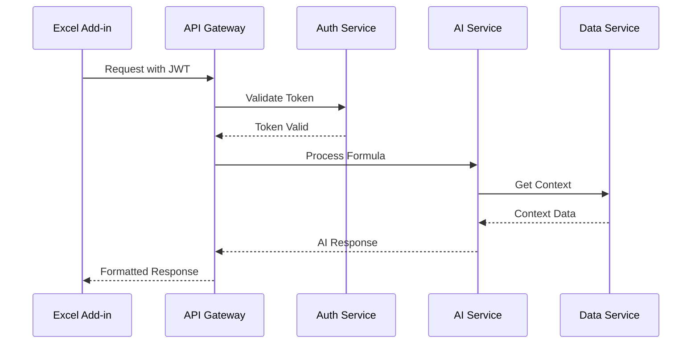

# API Gateway Service

Enterprise-grade API Gateway service for the AI-enhanced Excel Add-in that handles request routing, authentication, service orchestration, and security.

## Table of Contents

- [Overview](#overview)
- [Features](#features)
- [Installation](#installation)
- [Configuration](#configuration)
- [API Documentation](#api-documentation)
- [Security](#security)
- [Monitoring](#monitoring)
- [Troubleshooting](#troubleshooting)

## Overview

The API Gateway service acts as the central entry point for all client requests to the AI-enhanced Excel Add-in backend services. It provides robust request routing, authentication, rate limiting, and security controls while ensuring high availability and performance.

### Architecture



## Features

- OAuth 2.0 authentication with Azure AD integration
- JWT token validation with device fingerprinting
- Distributed rate limiting with Redis
- Request routing and service orchestration
- Comprehensive security controls
- Monitoring and observability
- Circuit breaker pattern implementation
- Graceful error handling

## Installation

### Prerequisites

- Node.js 18 LTS
- Redis 6.2+
- SSL certificates
- Azure AD application credentials

### Steps

1. Clone the repository:
```bash
git clone <repository-url>
cd src/backend/services/gateway
```

2. Install dependencies:
```bash
npm install
```

3. Configure environment variables:
```bash
cp .env.example .env
# Edit .env with your configuration
```

4. Start the service:
```bash
npm run start
```

## Configuration

### Environment Variables

```bash
# Server
PORT=3000
NODE_ENV=production

# Azure AD
MSAL_CONFIG={"clientId":"...","authority":"..."}
REDIRECT_URI=https://api.example.com/auth/callback

# Redis
REDIS_HOST=localhost
REDIS_PORT=6379
REDIS_PASSWORD=your-password
REDIS_TLS=true

# Rate Limiting
RATE_LIMIT_WINDOW=900000
RATE_LIMIT_MAX_REQUESTS=100

# Services
AI_SERVICE_URL=http://ai-service:3001
CORE_SERVICE_URL=http://core-service:3002
DATA_SERVICE_URL=http://data-service:3003
```

## API Documentation

### Authentication Endpoints

```typescript
POST /api/v1/auth/login
POST /api/v1/auth/refresh
POST /api/v1/auth/logout
```

### Formula Processing

```typescript
POST /api/v1/formula/suggest
GET /api/v1/formula/{id}
PUT /api/v1/formula/{id}
```

### Data Management

```typescript
POST /api/v1/data/clean
GET /api/v1/version/{id}
POST /api/v1/changes/batch
```

### Rate Limits

| Endpoint | Limit |
|----------|-------|
| formula/suggest | 100/min |
| data/clean | 20/min |
| version | 200/min |
| changes/batch | 50/min |

## Security

### Authentication Flow

1. Client obtains authorization code from Azure AD
2. Exchange code for access and refresh tokens
3. JWT tokens include device fingerprinting
4. Token validation with every request
5. Refresh token rotation with family tracking

### Security Headers

```typescript
app.use(helmet({
    contentSecurityPolicy: {
        directives: {
            defaultSrc: ["'self'"],
            scriptSrc: ["'self'", "'unsafe-inline'"],
            styleSrc: ["'self'", "'unsafe-inline'"],
            imgSrc: ["'self'", 'data:', 'https:'],
            connectSrc: ["'self'", ...CORS_ORIGINS]
        }
    },
    hsts: {
        maxAge: 31536000,
        includeSubDomains: true,
        preload: true
    }
}));
```

## Monitoring

### Health Check

```typescript
GET /health
```

### Metrics

```typescript
GET /metrics
```

Prometheus-format metrics including:
- Request rates
- Response times
- Error rates
- Authentication failures
- Rate limit hits

## Troubleshooting

### Common Error Codes

| Code | Description | Resolution |
|------|-------------|------------|
| AUTH_FAILED | Authentication failure | Verify credentials and token validity |
| RATE_LIMIT_EXCEEDED | Too many requests | Wait for rate limit window to reset |
| TOKEN_INVALID | Invalid JWT token | Obtain new token via refresh flow |
| PROXY_ERROR | Service unavailable | Check target service health |

### Logging

All security events and errors are logged with correlation IDs for tracing:

```typescript
{
    level: 'error',
    code: 'AUTH_FAILED',
    message: 'Token validation failed',
    correlationId: '1234abcd',
    timestamp: '2023-09-20T10:00:00Z',
    details: {
        path: '/api/v1/formula/suggest',
        method: 'POST'
    }
}
```

For more detailed troubleshooting, enable debug logging by setting `DEBUG=api-gateway:*` environment variable.