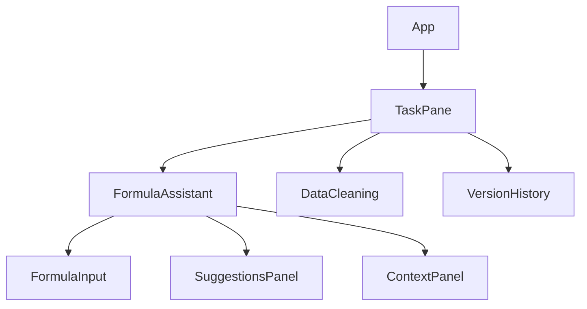

# Excel AI Add-in Frontend

Enterprise-grade Excel Add-in that provides AI-powered formula assistance and data management capabilities using TypeScript, React, and Office.js.

## Prerequisites

- Node.js >= 18.0.0 LTS
- npm >= 8.0.0
- Microsoft Office (Excel) >= 2019
- Supported Browsers:
  - Microsoft Edge >= 88
  - Google Chrome >= 88
  - Safari >= 14
- VS Code with recommended extensions
- Office 365 Developer Account

## Getting Started

### Installation

1. Clone the repository
2. Install dependencies:
```bash
npm install
```

### Development Certificates

For local HTTPS development:

1. Generate development certificates:
```bash
mkdir certs
openssl req -newkey rsa:2048 -nodes -keyout certs/server.key -x509 -days 365 -out certs/server.crt
```

2. Trust the certificate in your development environment

### Environment Setup

Create a `.env` file in the root directory:

```env
NODE_ENV=development
OFFICE_DEBUG=true
API_BASE_URL=https://localhost:3001
AUTH_ENDPOINT=https://login.microsoftonline.com
APP_INSIGHTS_KEY=your_key_here
```

### Development Server

Start the development server:

```bash
npm start
```

Access the add-in at `https://localhost:3000`

### Production Build

Create optimized production build:

```bash
npm run build
```

## Project Structure

```
src/
├── components/     # Reusable UI components
├── pages/         # Main application pages/views
├── hooks/         # Custom React hooks
├── services/      # API and business logic services
├── store/         # Redux state management
├── utils/         # Utility functions
├── interfaces/    # TypeScript interfaces
├── types/         # TypeScript type definitions
├── constants/     # Application constants
└── config/        # Configuration files
```

## Architecture

### Component Hierarchy



### State Management

- Redux Toolkit for global state
- React Context for UI state
- Redux-Persist for state persistence
- Middleware for side effects

### Office.js Integration

- Task Pane UI using Office UI Fabric React
- Excel.run() for worksheet operations
- Event-based communication
- Error boundary implementation

## Development Guidelines

### TypeScript Configuration

- Strict type checking enabled
- Path aliases configured
- ESNext target with ES6 modules
- Isolated modules for better build performance

### Code Style

- ESLint with TypeScript support
- Prettier for code formatting
- React hooks linting
- Office Add-ins specific rules

### Performance Optimization

- Code splitting with React.lazy()
- Webpack bundle optimization
- Tree shaking enabled
- Compression for production builds
- Virtual scrolling for large datasets

## Testing

### Unit Testing

```bash
# Run tests
npm test

# Watch mode
npm run test:watch

# Coverage report
npm run test:coverage
```

Coverage requirements:
- Statements: 90%
- Branches: 85%
- Functions: 90%
- Lines: 90%

### E2E Testing

```bash
# Run E2E tests
npm run test:e2e
```

### Accessibility Testing

```bash
# Run accessibility tests
npm run test:a11y
```

## Deployment

### Production Build Optimization

- Minification and uglification
- Tree shaking
- Code splitting
- Gzip compression
- Source maps generation

### Environment Configuration

- Environment-specific builds
- Configuration validation
- Secret management
- Feature flags support

### CI/CD Pipeline

1. Code quality checks
2. Unit tests
3. Build validation
4. E2E tests
5. Bundle analysis
6. Production deployment

## Contributing

### Branch Strategy

- `main`: Production-ready code
- `develop`: Integration branch
- `feature/*`: New features
- `bugfix/*`: Bug fixes
- `hotfix/*`: Production fixes

### Commit Convention

```
type(scope): description

[optional body]

[optional footer]
```

Types:
- feat: New feature
- fix: Bug fix
- docs: Documentation
- style: Formatting
- refactor: Code restructuring
- test: Tests
- chore: Build/dependencies

### Pull Request Process

1. Create feature branch
2. Implement changes
3. Add/update tests
4. Update documentation
5. Create pull request
6. Code review
7. Address feedback
8. Merge to develop

## Security

- HTTPS enforced
- Content Security Policy
- OAuth 2.0 authentication
- API request validation
- Data encryption
- XSS prevention
- CSRF protection

## Support

- Documentation: `/docs`
- Issue Tracker: GitHub Issues
- Wiki: Project Wiki
- Teams Channel: Excel AI Add-in Team

## License

Copyright © 2023 Excel AI Add-in. All rights reserved.